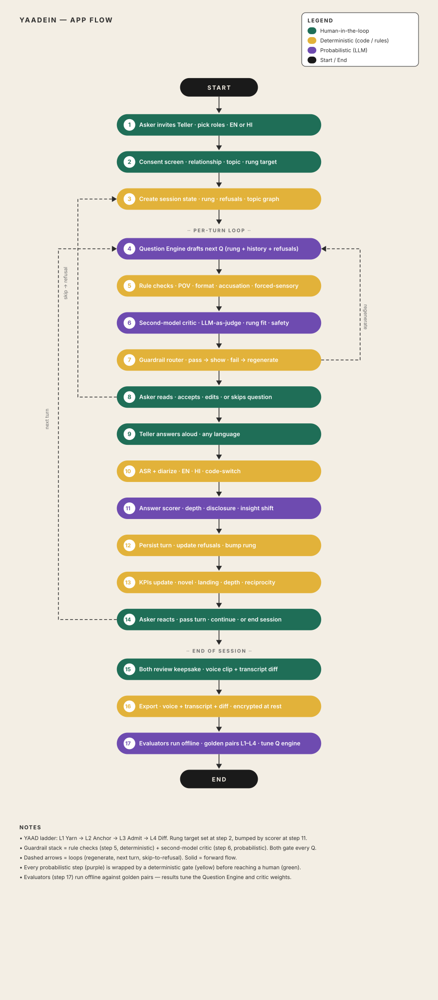

# yaadein

**One topic, four questions, one memory that didn't exist until someone asked.**

🔗 **Live app: [yaadien-momtest.vercel.app](https://yaadien-momtest.vercel.app)**

Yaadein is a voice-first interview app for asking someone you love the questions
you never knew how to ask. An *asker* interviews a parent, grandparent or old
friend about one topic, climbing four rungs that get progressively deeper — and
every answer becomes context for the next question. It runs across two devices
on one 5-character session code, or solo in Reflection mode.

---

## The idea

Most of us have a story in our family that nobody has ever written down. Not a
formal interview — just the thing your mother says about her childhood, or your
grandfather says about the house he grew up in, and everyone nods and nobody
asks the second question.

Yaadein gives you the right questions, in the right order, and gets out of the way.

### The four-rung framework

The four rungs spell **YAAD**:

| Rung | Name | Asks for |
|---|---|---|
| **Y** | **Yesteryears** | Dates, places, names. A stranger could answer it. Costs nothing — its only job is to make the next rung possible. |
| **A** | **Atmosphere** | What it was actually like — smell, sound, what was in the room, what their hands were doing. |
| **A** | **Afterword** | What they made of it — regret, pride, judgment. Now they have to think. |
| **D** | **Disclosure** | The thing they have never put into words *for you*. |

> *The deepest rung invites, it never corners. Never presume trauma or force disclosure.*

Each rung has **three question options**, written on demand by the model. The
asker can switch between them, reject one to get another, or — once all three
exist — write their own question instead. The thread only ends when the
respondent passes on all three. The asker is never dead-ended.

---

## Two ways to use it

### Together (`/asker`) — two people, two devices

1. **Sign in** with Google, give consent, tell us a little about yourself (once).
2. **Start a thread** — pick a topic from a prompt pack or write your own, say
   who you're asking, set anything that's off-limits, choose English or हिन्दी.
3. **Share the 5-character code** (or the join link) with the person you're asking.
4. They **join, confirm their profile and record** their answer to the first rung.
5. You review the next question — **accept, reject for a new one, or substitute
   your own** — and it goes straight to their device.
6. Climb **Y → A → A → D**, one rung at a time.
7. **Read the transcript together**, take a short survey, and optionally
   **swap roles** so they can interview you next.

### Reflection (`/reflection`) — one person, one device

Pick a topic, answer the same four-rung ladder by yourself, on your own phone.
No second device, no review step, no sharing required. Private to you.

---

## Workflow

Session loop between Asker and Teller across three lanes — human-in-the-loop,
deterministic rules, and probabilistic model calls.



---

## Features

- **🎙 Voice-first recording** — `MediaRecorder` in the browser with
  webm/opus on Chrome and mp4 fallback for iOS Safari, so it works wherever
  your family actually is.
- **🔊 Waveform playback** — real peak-derived waveforms and full scrubbing,
  streamed with HTTP `Range` support so iPhone Safari can seek.
- **🧠 On-demand questions** — Claude writes each question from what was
  actually said in the previous answer. Groq Whisper handles speech-to-text
  (with automatic language detection). No other model sees the names or
  transcripts.
- **🔀 Three options per rung** — accept, reject, or write your own; rejects
  are logged with their outcome instead of being thrown away.
- **📚 15 prompt packs, 155 threads** — Family Roots, Love & Marriage, What I
  Believe, Things Nobody Ever Asks, What Changed Me, Dreams & the Future,
  Recipes & Traditions, Just for Fun, and more. A picked thread supplies rung 1
  verbatim with no model call, so the conversation starts instantly.
- **🇮🇳 English / हिन्दी** — full interface and question generation in both
  languages, fixed per session, with Devanagari typography throughout.
- **🔗 7-day share links** — a private, unindexed transcript page at `/t/[token]`
  so you can send the conversation back to the family.
- **🔁 Reciprocity** — after the interview, the respondent can start a new
  thread with roles swapped.
- **📊 Post-interview survey** — insight shift, novelty of the disclosure,
  question quality, keepsake value and waitlist intent, captured for both roles.
- **🛡 Safety guardrails** — off-limits topics enforced, banned phrases blocked,
  and **PII masking** (phone, email, ID numbers, addresses, dates) applied to
  transcripts before anything reaches the model.
- **🔒 Google sign-in & consent** — Supabase Auth with PKCE; consent and the
  "About you" profile are collected once per account.
- **📱 Two devices, one code** — plain 1.5-second polling, no websockets, no
  pairing dance.

---

## Architecture

```
Browser (asker)                Browser (respondent)
      │  POST /api/...               │  poll GET /api/session/{code} @1.5s
      └──────────────┬───────────────┘
                     ▼
      Vercel  ── /api/* ──►  Python FastAPI service (src/yaadein)
                     │             ├─ Upstash Redis     system of record (24h TTL)
                     │             ├─ Anthropic Claude  question generation
                     │             ├─ Groq Whisper      speech → text
                     │             ├─ Supabase          auth, profiles, durable rows
                     │             └─ Vercel Blob       private audio (24h, cron-cleaned)
                     │
      Vercel  ── everything else ──►  Next.js 16 frontend (web/)
                     │
                     └─ after-response ──► Google Apps Script ──► Sheet (research log)
                                                               └─► Drive (audio archive)
```

**Five stores, five jobs:** Redis is the live database, Supabase owns accounts
and durable rows, Vercel Blob serves playback audio, Google Drive archives it
permanently, and the Google Sheet is a write-only research log the team codes
in a spreadsheet.

### Tech stack

| Layer | |
|---|---|
| Frontend | **Next.js 16.3.5**, **React 19.2.8**, TypeScript 5.9, Tailwind CSS v4 |
| UI | Bodoni Moda + Nanum Myeongjo + Karla type system, Phosphor icons, i18next |
| Backend | **Python 3.12 + FastAPI**, Pydantic, Starlette background tasks |
| AI | Anthropic Claude (questions) · Groq Whisper (transcription) |
| Data | Upstash Redis · Supabase (Postgres + Auth) · Vercel Blob |
| Integrations | Google Apps Script → Sheets + Drive |
| Deploy | Vercel (two-service `vercel.json`: Python for `/api/*`, Next for the rest) |
| Tests | `pytest` (38 unit files + a full-flow integration test) · `tsx --test` (13 web suites) |

---

## Getting started

```bash
git clone https://github.com/s3llabs/yaadien-submission.git
cd yaadien-submission
```

> This repository contains the project README. The full source lives in the
> team's private workspace; the deployed app is the canonical demo.

Create `web/.env.local` from `web/.env.example`. The load-bearing ones:

```
UPSTASH_REDIS_REST_URL / UPSTASH_REDIS_REST_TOKEN   # session store
BLOB_READ_WRITE_TOKEN                              # audio upload + playback
GROQ_API_KEY                                       # Whisper transcription
ANTHROPIC_API_KEY                                  # question generation
SUPABASE_URL / SUPABASE_ANON_KEY / SUPABASE_SERVICE_ROLE_KEY
NEXT_PUBLIC_SUPABASE_URL / NEXT_PUBLIC_SUPABASE_ANON_KEY
CRON_SECRET                                        # audio cleanup + sheet export
```

Run both services the way production does:

```bash
vercel dev -L        # /api/* → FastAPI on :8000, everything else → Next on :3000
```

Or separately:

```bash
make run                       # uvicorn yaadein.api.app:app --reload --port 8000
cd web && npm run dev          # http://localhost:3000
```

Quality gates (what CI runs):

```bash
make check        # ruff + mypy (strict) + pytest
make test-web     # web/tests/*.test.ts
npx tsc --noEmit  # in web/
```

---

## Repo map

```
web/            Next.js app — pages, components, i18n, recorder, polling
src/yaadein/    Python FastAPI backend — state machine, prompts, guardrails, providers
supabase/       SQL migrations (sessions, questions, answers, surveys, packs)
tests/          pytest suites, including a full-flow integration test
apps-script/    Google Apps Script — Sheet logger, Drive uploader, Supabase export
docs/           Developer guide, data schema, guardrails, evaluators, runbooks
mvp/            The original terminal prototype the framework was written in
evals/          Golden input→output pairs for the question engine
branding-kit/   Typography rules and font licences
```

---

## What's next

- Rate limiting and a true API-level auth gate on every session endpoint
- A "my threads" history across the 24-hour Redis TTL
- Sheets export on a shorter schedule than the daily cron
- Mobile share sheet + native-feel recording UI

---

*yaadein* — Hindi/Urdu for *memories*; things remembered, and the act of remembering.
